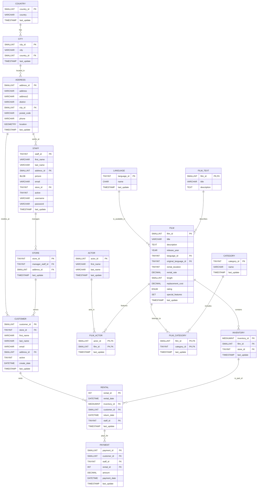

# MySQL sakila Database Analysis | Assignment
## Content
1. [Overview](#overview)
2. [Database EDR](#database-edr)
3. [Queries and Results](#queries-and-results)
## Overview
This assignment was given to assess my SQL skills using the `sakila` database, which is installed locally in MySQL. The `sakila` database contains data across 16 tables, focusing on rental transactions of films for various movie rental stores. The task was assigned by a technical instructor to evaluate both basic and advanced SQL querying skills.
### Key Skills Applied:
- Basic `SELECT` statements.
- Applying **aliases**.
- Utilizing **ranking** and **partition** operations.
- Filtering data using the `WHERE` clause.
- **Grouping** results with `GROUP BY` to summarize information.
- Implementing **subqueries** in various contexts, including:
  - **Filtering** after the `WHERE` clause.
  - Extracting data from a subquery after the `FROM` clause.
  - **Nesting** subqueries for complex queries.
- Employing multiple `JOINS` to relate tables and using `USING` to identify the `PRIMARY KEY` in each `JOIN` operation.
## Database EDR

## Queries and Results
### 1. Which films had the longest run time in each rating?
```sql
SELECT Rating, Film
FROM(
    SELECT
        rating AS Rating,
        title AS Film,
        ROW_NUMBER() OVER(PARTITION BY rating ORDER BY length DESC) AS RowNum
    FROM film
    WHERE length IN (SELECT runtime 
    FROM (
        SELECT rating, MAX(length) AS runtime
        FROM film 
        GROUP BY rating) AS SQ)
    ORDER BY Rating, length DESC) AS SQ2
WHERE RowNum = 1
```
### Results:
- This query returns the longest movie by each rating.
- **NOTE:** There are multiple movies with the same maximum length, but in this query we only return the first movie that appears in an alphapetical order.
### 2. What is the newest movie across each language?
```sql
SELECT 
    lng.name AS Language,
    flm.title AS "Film Name"
FROM film AS flm
JOIN language AS lng ON flm.language_id = lng.language_id
WHERE release_year = (SELECT max(release_year) from film)
```
### Results:
- Well, well! It seems like all the movies in "Film" table were released in **2006**, and they're all in **English** as well.
- We might investigate this issue by filtering over these columns.
#### Languages other than English:
```sql
SELECT 
    lng.name AS Language,
    flm.title AS "Film Name"
FROM film AS flm
JOIN language AS lng ON flm.language_id = lng.language_id
WHERE lng.name != 'English'
```
None!
#### Release year other than 2006:
```sql
SELECT 
    lng.name AS Language,
    flm.title AS "Film Name"
FROM film AS flm
JOIN language AS lng ON flm.language_id = lng.language_id
WHERE release_year != 2006
```
None!

### Who are the top 5 recurring actors in action and drama films?
```sql
SELECT most_frequent_actors AS "Top 5 Recurring Action and Drama Actors"
FROM(
    SELECT 
        CONCAT(a.first_name, ' ', a.last_name) AS most_frequent_actors,
        COUNT(*) AS movie_frequency
    FROM rental AS r
    JOIN inventory AS inv USING(inventory_id)
    JOIN film AS flm USING(film_id)
    JOIN film_actor AS fc USING(film_id)
    JOIN actor AS a USING(actor_id)
    JOIN film_category AS flmctg USING(film_id)
    JOIN category AS ctg USING(category_id)
    WHERE ctg.name in ('Action','Drama')
    GROUP BY most_frequent_actors
    ORDER BY movie_frequency DESC LIMIT 5) AS sq4
```
### Results:
The Top 5 Recurring Action and Drama Stars are:
1. NATALIE HOPKINS
2. WALTER TORN
3. JON CHASE
4. MORGAN HOPKINS
5. ANGELA WITHERSPOON
### Which genre is the most recurring?
```sql
SELECT most_frequent_genre AS "Most Frequent Genre"
FROM(
    SELECT 
        ctg.name AS most_frequent_genre,
        COUNT(*) AS movie_frequency
    FROM rental AS r
    JOIN inventory AS inv USING(inventory_id)
    JOIN film AS flm USING(film_id)
    JOIN film_category USING(film_id)
    JOIN category AS ctg USING(category_id)
    GROUP BY ctg.name
    ORDER BY movie_frequency DESC LIMIT 1) AS sq
```
### Results:
Most Recurring Genre: **Sports**
### What are the top 3 movies in this genre by rental rate?
```sql
SELECT most_frequent_movies AS "Top 3 Sports Movies"
FROM(
    SELECT 
        flm.title AS most_frequent_movies,
        COUNT(*) AS movie_frequency
    FROM rental AS r
    JOIN inventory AS inv USING(inventory_id)
    JOIN film AS flm USING(film_id)
    JOIN film_category USING(film_id)
    JOIN category AS ctg USING(category_id)
    WHERE ctg.name = "Sports"
    GROUP BY flm.title
    ORDER BY movie_frequency DESC LIMIT 3) AS sq3
```
### Results:
Top 3 Movies in Sports Genre:
1. GLEAMING JAWBREAKER
2. TALENTED HOMICIDE
3. ROSES TREASURE
